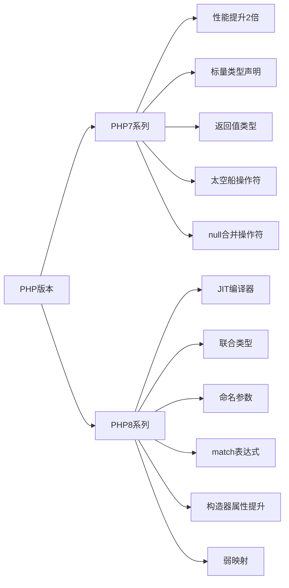

# PHP7和PHP8有哪些重要的新特性？

## 概要回答

PHP7和PHP8带来了许多重要改进：
- **PHP7**：性能大幅提升、标量类型声明、返回值类型声明、太空船操作符、null合并操作符等
- **PHP8**：JIT编译器、联合类型、命名参数、match表达式、构造器属性提升、弱映射等

## 深度解析

### PHP7系列重要新特性

#### 1. 性能提升
PHP7最大的改进就是性能，相比PHP5.x版本性能提升了近2倍，主要得益于Zend引擎的重写。

#### 2. 标量类型声明
```php
function sum(int $a, int $b): int {
    return $a + $b;
}
```

#### 3. 返回值类型声明
```php
function getName(): string {
    return "PHP";
}
```

#### 4. 太空船操作符（组合比较运算符）
```php
echo 1 <=> 1; // 0
echo 1 <=> 2; // -1
echo 2 <=> 1; // 1
```

#### 5. null合并操作符
```php
$username = $_GET['user'] ?? 'nobody';
```

### PHP8重要新特性

#### 1. JIT编译器
Just-In-Time编译器是PHP8最重要的特性之一，对于CPU密集型应用性能提升显著。

#### 2. 联合类型
```php
function double(int|float $num): int|float {
    return $num * 2;
}
```

#### 3. 命名参数
```php
function greet(string $name, string $greeting = "Hello") {
    echo "$greeting, $name!";
}

greet(name: "张三", greeting: "你好");
```

#### 4. match表达式
```php
$result = match($statusCode) {
    200, 201 => "Success",
    400 => "Client Error",
    500 => "Server Error",
    default => "Unknown Status"
};
```

#### 5. 构造器属性提升
```php
class Point {
    public function __construct(
        public float $x = 0.0,
        public float $y = 0.0
    ) {}
}
```

## 图形化表达

