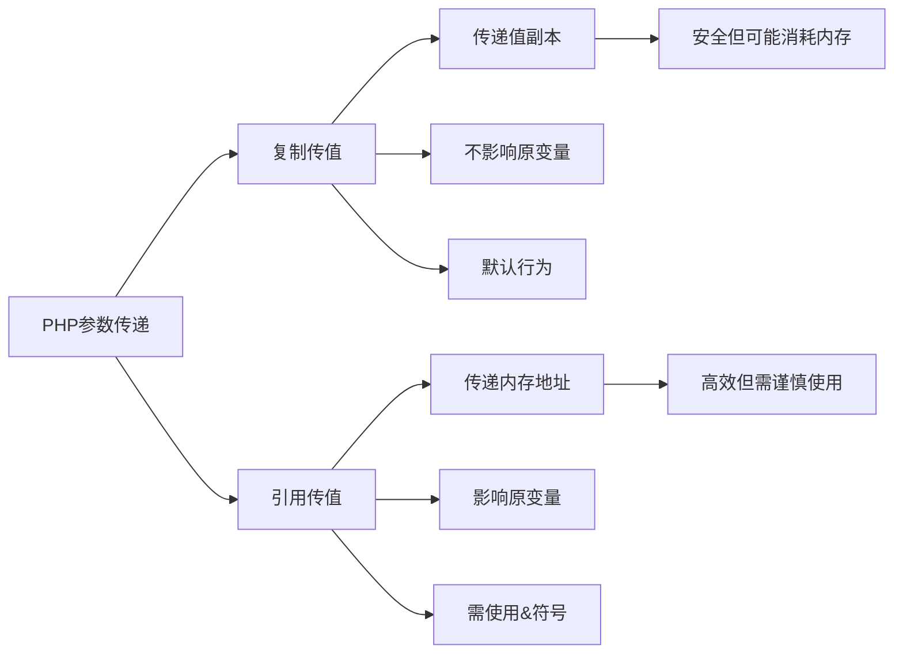

# 解释PHP中的引用传值和复制传值的区别？

## 概要回答

在PHP中，变量默认通过复制传值（值传递），而引用传值需要显式使用&符号标识。主要区别在于：
- **复制传值**：传递的是变量值的副本，修改不会影响原始变量
- **引用传值**：传递的是变量的内存地址，修改会影响原始变量

## 深度解析

### 复制传值（值传递）

当变量通过值传递时，PHP会创建一个原始变量值的副本。这意味着在函数内部对该变量的任何修改都不会影响原始变量。

```php
<?php
function modifyValue($param) {
    $param = 100;
    echo "函数内 \$param 的值: $param\n"; // 输出: 100
}

$value = 10;
modifyValue($value);
echo "函数外 \$value 的值: $value\n"; // 输出: 10
?>
```

### 引用传值

引用传值通过在变量前加上&符号来实现，传递的是变量的内存地址而不是值的副本。因此，在函数内部对变量的修改会直接影响原始变量。

```php
<?php
function modifyReference(&$param) {
    $param = 100;
    echo "函数内 \$param 的值: $param\n"; // 输出: 100
}

$value = 10;
modifyReference($value);
echo "函数外 \$value 的值: $value\n"; // 输出: 100
?>
```

### 引用传值的应用场景

1. **函数需要修改传入的变量值**
```php
function swap(&$a, &$b) {
    $temp = $a;
    $a = $b;
    $b = $temp;
}
```

2. **避免大数组或对象复制的性能开销**
```php
function processData(&$largeArray) {
    // 对大数组进行处理而不复制
    foreach ($largeArray as &$item) {
        $item *= 2;
    }
}
```

3. **返回多个值**
```php
function calculate($a, $b, &$sum, &$product) {
    $sum = $a + $b;
    $product = $a * $b;
}

calculate(5, 3, $sum, $product);
echo "Sum: $sum, Product: $product"; // Sum: 8, Product: 15
```

### 注意事项

1. **对象默认按引用传递**：在PHP中，对象本身就是按引用传递的，不需要显式使用&符号
```php
class MyClass {
    public $value = 10;
}

function modifyObject($obj) {
    $obj->value = 100;
}

$myObj = new MyClass();
modifyObject($myObj);
echo $myObj->value; // 输出: 100
```

2. **谨慎使用引用**：过度使用引用可能导致代码难以理解和维护

## 图形化表达

