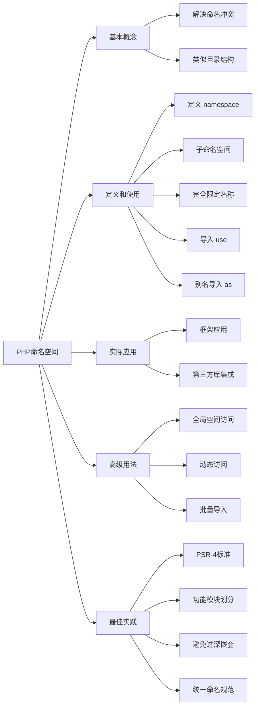

# 如何理解和使用PHP的命名空间？

## 概要回答

PHP命名空间（Namespace）是用来解决类、函数和常量名称冲突的一种机制。它允许我们在同一个项目中使用相同名称的类而不发生冲突，提高了代码的组织性和可维护性。

## 深度解析

### 命名空间的基本概念

命名空间类似于文件系统中的目录结构，可以将相关的类、接口、函数和常量组织在一起，避免命名冲突。

```php
<?php
// 定义命名空间
namespace App\Models;

class User {
    // 类实现
}
?>
```

### 命名空间的定义和使用

#### 1. 定义命名空间
```php
<?php
// 必须在文件开头（除declare外）
namespace App\Controllers;

class UserController {
    // 控制器实现
}
?>
```

#### 2. 子命名空间
```php
<?php
namespace App\Controllers\Admin;

class DashboardController {
    // 后台控制器
}
?>
```

### 使用命名空间中的类

#### 1. 完全限定名称
```php
<?php
$obj = new \App\Models\User();
?>
```

#### 2. 导入命名空间
```php
<?php
use App\Models\User;
use App\Controllers\UserController;

$user = new User();
$controller = new UserController();
?>
```

#### 3. 别名导入
```php
<?php
use App\Models\User as UserModel;
use App\Controllers\UserController as UserCtrl;

$user = new UserModel();
$controller = new UserCtrl();
?>
```

### 命名空间的实际应用场景

#### 1. 框架中的应用
```php
<?php
// Laravel框架示例
namespace App\Http\Controllers;

use Illuminate\Http\Request;
use App\Models\User;

class UserController extends Controller {
    public function index() {
        $users = User::all();
        return view('users.index', compact('users'));
    }
}
?>
```

#### 2. 第三方库的集成
```php
<?php
// 使用不同的日志库
use Monolog\Logger as MonologLogger;
use Psr\Log\LoggerInterface;

class LoggerService {
    private LoggerInterface $logger;
    
    public function __construct() {
        $this->logger = new MonologLogger('app');
    }
}
?>
```

### 命名空间的高级用法

#### 1. 全局空间访问
```php
<?php
namespace App;

// 访问全局函数
$result = \strlen('Hello World');

// 访问全局类
$exception = new \Exception('错误信息');
?>
```

#### 2. 动态访问命名空间元素
```php
<?php
namespace App;

function getClassName() {
    return __NAMESPACE__ . '\User';
}

$className = getClassName();
$obj = new $className();
?>
```

#### 3. 批量导入
```php
<?php
use App\Models\{
    User,
    Post,
    Comment
};

// 等同于分别导入三个类
?>
```

### 命名空间最佳实践

1. **遵循PSR-4标准**：命名空间应与目录结构对应
2. **合理组织命名空间**：按照功能模块划分
3. **避免过深的嵌套**：一般不超过3-4层
4. **统一命名规范**：使用大写字母开头的驼峰命名

## 图形化表达

