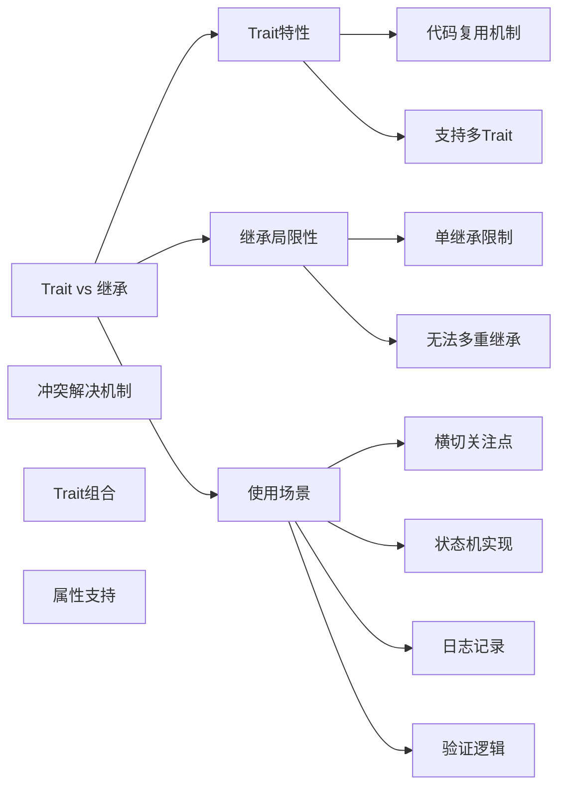

# trait是什么？它与继承有什么区别？

## 概要回答

Trait是PHP中实现代码复用的一种机制，它允许开发者在不使用多重继承的情况下，将方法和属性注入到类中。与传统的继承相比，trait提供了更灵活的代码组合方式，一个类可以同时使用多个trait。

## 深度解析

### Trait的基本概念

Trait是在PHP 5.4中引入的一个特性，旨在解决单继承语言的局限性。它可以看作是一种代码复用的机制，允许我们将一组方法注入到不同的类中。

```php
<?php
trait Loggable {
    public function log($message) {
        echo "[" . date('Y-m-d H:i:s') . "] $message\n";
    }
}

class UserService {
    use Loggable;
    
    public function createUser($name) {
        // 创建用户的逻辑
        $this->log("用户 $name 已创建");
    }
}

$userService = new UserService();
$userService->createUser("张三");
// 输出: [2023-01-01 12:00:00] 用户 张三 已创建
?>
```

### Trait与继承的区别

#### 1. 继承的局限性
```php
<?php
class Animal {
    public function eat() {
        echo "动物在吃东西\n";
    }
}

class Dog extends Animal {
    public function bark() {
        echo "狗在叫\n";
    }
}

// 错误：PHP不支持多重继承
// class MyDog extends Animal, AnotherClass {
// }
?>
```

#### 2. Trait的灵活性
```php
<?php
trait Flyable {
    public function fly() {
        echo "我会飞\n";
    }
}

trait Swimmable {
    public function swim() {
        echo "我会游泳\n";
    }
}

class Duck {
    use Flyable, Swimmable;
    
    public function quack() {
        echo "嘎嘎叫\n";
    }
}

$duck = new Duck();
$duck->fly();   // 输出: 我会飞
$duck->swim();  // 输出: 我会游泳
$duck->quack(); // 输出: 嘎嘎叫
?>
```

### Trait的高级特性

#### 1. 方法冲突解决
```php
<?php
trait A {
    public function smallTalk() {
        echo 'a';
    }
    
    public function bigTalk() {
        echo 'A';
    }
}

trait B {
    public function smallTalk() {
        echo 'b';
    }
    
    public function bigTalk() {
        echo 'B';
    }
}

class Talker {
    use A, B {
        // 使用B的smallTalk方法
        B::smallTalk insteadof A;
        // 使用A的bigTalk方法，并起别名为talk
        A::bigTalk as talk;
    }
}

$talker = new Talker();
$talker->smallTalk(); // 输出: b
$talker->talk();      // 输出: A
?>
```

#### 2. Trait组合
```php
<?php
trait Hello {
    public function sayHello() {
        echo 'Hello ';
    }
}

trait World {
    public function sayWorld() {
        echo 'World!';
    }
}

trait HelloWorld {
    use Hello, World;
}

class MyHelloWorld {
    use HelloWorld;
}

$hello = new MyHelloWorld();
$hello->sayHello(); // 输出: Hello 
$hello->sayWorld(); // 输出: World!
?>
```

#### 3. 属性定义
```php
<?php
trait PropertiesTrait {
    public $x = 1;
    protected $y = 2;
    private $z = 3;
}

class PropertiesExample {
    use PropertiesTrait;
    
    public function showProperties() {
        echo "x: $this->x\n"; // 可以访问public属性
        echo "y: $this->y\n"; // 可以访问protected属性
        // echo "z: $this->z\n"; // 不能访问private属性
    }
}
?>
```

### Trait与接口的区别

| 特性 | Trait | 接口 |
|------|-------|------|
| 代码实现 | 提供具体实现 | 只定义方法签名 |
| 多重使用 | 支持多个trait | 支持多个接口 |
| 属性支持 | 支持属性定义 | 不支持属性定义 |
| 冲突解决 | 提供冲突解决机制 | 需要实现类解决 |

### Trait使用场景

#### 1. 横切关注点
```php
<?php
trait Timestampable {
    private $createdAt;
    private $updatedAt;
    
    public function setCreatedAt($time = null) {
        $this->createdAt = $time ?: new DateTime();
    }
    
    public function setUpdatedAt($time = null) {
        $this->updatedAt = $time ?: new DateTime();
    }
    
    public function getCreatedAt() {
        return $this->createdAt;
    }
    
    public function getUpdatedAt() {
        return $this->updatedAt;
    }
}

class Article {
    use Timestampable;
    
    private $title;
    
    public function __construct($title) {
        $this->title = $title;
        $this->setCreatedAt();
    }
}
?>
```

#### 2. 状态机实现
```php
<?php
trait StateMachine {
    private $state;
    
    public function setState($state) {
        $this->state = $state;
    }
    
    public function getState() {
        return $this->state;
    }
    
    public function canTransitionTo($newState) {
        // 状态转换逻辑
        return true;
    }
}

class Order {
    use StateMachine;
    
    public function __construct() {
        $this->setState('pending');
    }
}
?>
```

## 图形化表达

