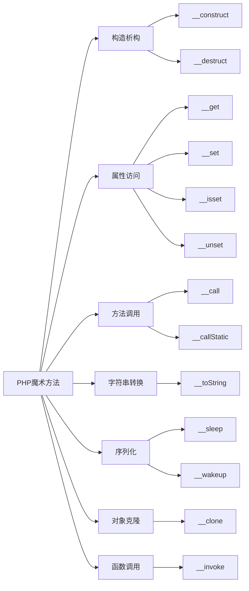

# 解释PHP中的魔术方法及其使用场景？

## 概要回答

PHP魔术方法是以双下划线（__）开头的特殊方法，它们在特定情况下会被自动调用。常见的魔术方法包括__construct()、__destruct()、__get()、__set()、__call()等，它们提供了对对象行为的精细控制，增强了类的灵活性。

## 深度解析

### 魔术方法的基本概念

魔术方法是PHP中一类特殊的预定义方法，它们会在特定的条件下被自动触发。这些方法为我们提供了强大的元编程能力，可以控制对象的创建、销毁、属性访问、方法调用等行为。

### 构造和析构魔术方法

#### __construct()
构造方法在创建对象时自动调用，用于初始化对象属性。

```php
<?php
class User {
    private $name;
    private $email;
    
    public function __construct($name, $email) {
        $this->name = $name;
        $this->email = $email;
        echo "用户 {$name} 已创建\n";
    }
}

$user = new User("张三", "zhangsan@example.com");
// 输出: 用户 张三 已创建
?>
```

#### __destruct()
析构方法在对象被销毁时自动调用，通常用于清理资源。

```php
<?php
class DatabaseConnection {
    private $connection;
    
    public function __construct() {
        $this->connection = mysqli_connect("localhost", "user", "pass", "db");
        echo "数据库连接已建立\n";
    }
    
    public function __destruct() {
        if ($this->connection) {
            mysqli_close($this->connection);
            echo "数据库连接已关闭\n";
        }
    }
}

$db = new DatabaseConnection();
// 当脚本结束或对象被销毁时，会自动调用__destruct()
?>
```

### 属性访问魔术方法

#### __get()和__set()
这两个方法在访问或设置不可访问的属性时被调用。

```php
<?php
class User {
    private $data = [];
    
    public function __get($name) {
        echo "正在获取属性: $name\n";
        return isset($this->data[$name]) ? $this->data[$name] : null;
    }
    
    public function __set($name, $value) {
        echo "正在设置属性: $name = $value\n";
        $this->data[$name] = $value;
    }
    
    public function __isset($name) {
        echo "检查属性是否存在: $name\n";
        return isset($this->data[$name]);
    }
    
    public function __unset($name) {
        echo "删除属性: $name\n";
        unset($this->data[$name]);
    }
}

$user = new User();
$user->name = "张三";        // 调用__set()
echo $user->name;           // 调用__get()
var_dump(isset($user->name)); // 调用__isset()
unset($user->name);         // 调用__unset()
?>
```

### 方法调用魔术方法

#### __call()和__callStatic()
这两个方法在调用不存在的方法时被触发。

```php
<?php
class Calculator {
    public function __call($name, $arguments) {
        echo "调用对象方法: $name，参数: " . json_encode($arguments) . "\n";
        
        switch ($name) {
            case 'add':
                return array_sum($arguments);
            case 'multiply':
                return array_product($arguments);
            default:
                throw new Exception("方法 $name 不存在");
        }
    }
    
    public static function __callStatic($name, $arguments) {
        echo "调用静态方法: $name，参数: " . json_encode($arguments) . "\n";
        
        // 静态方法调用处理
        $instance = new self();
        return call_user_func_array([$instance, $name], $arguments);
    }
}

$calc = new Calculator();
echo $calc->add(1, 2, 3, 4) . "\n";           // 输出: 10
echo Calculator::multiply(2, 3, 4) . "\n";    // 输出: 24
?>
```

### 字符串转换魔术方法

#### __toString()
当对象被当作字符串使用时调用此方法。

```php
<?php
class Person {
    private $name;
    private $age;
    
    public function __construct($name, $age) {
        $this->name = $name;
        $this->age = $age;
    }
    
    public function __toString() {
        return "姓名: {$this->name}, 年龄: {$this->age}";
    }
}

$person = new Person("张三", 25);
echo $person;  // 输出: 姓名: 张三, 年龄: 25
?>
```

### 序列化相关魔术方法

#### __sleep()和__wakeup()
这两个方法在序列化和反序列化过程中被调用。

```php
<?php
class DatabaseConnection {
    private $host;
    private $username;
    private $password;
    private $connection;
    
    public function __construct($host, $username, $password) {
        $this->host = $host;
        $this->username = $username;
        $this->password = $password;
        $this->connect();
    }
    
    private function connect() {
        // 建立数据库连接
        $this->connection = "数据库连接对象";
        echo "数据库连接已建立\n";
    }
    
    public function __sleep() {
        // 序列化时只保存必要的属性
        echo "准备序列化对象\n";
        return ['host', 'username', 'password'];
    }
    
    public function __wakeup() {
        // 反序列化后重新建立连接
        echo "对象已反序列化，重新建立连接\n";
        $this->connect();
    }
}

$conn = new DatabaseConnection("localhost", "user", "pass");
$serialized = serialize($conn);
$unserialized = unserialize($serialized);
?>
```

### 克隆魔术方法

#### __clone()
当对象被克隆时调用此方法。

```php
<?php
class Address {
    public $street;
    
    public function __construct($street) {
        $this->street = $street;
    }
}

class Person {
    public $name;
    public $address;
    
    public function __construct($name, $street) {
        $this->name = $name;
        $this->address = new Address($street);
    }
    
    public function __clone() {
        // 实现深拷贝
        $this->address = clone $this->address;
    }
}

$person1 = new Person("张三", "北京路123号");
$person2 = clone $person1;
$person2->name = "李四";
$person2->address->street = "上海路456号";

echo $person1->name . "住在" . $person1->address->street . "\n"; // 张三住在北京路123号
echo $person2->name . "住在" . $person2->address->street . "\n"; // 李四住在上海路456号
?>
```

### 调用链魔术方法

#### __invoke()
让对象可以像函数一样被调用。

```php
<?php
class Multiplier {
    private $factor;
    
    public function __construct($factor) {
        $this->factor = $factor;
    }
    
    public function __invoke($number) {
        return $number * $this->factor;
    }
}

$double = new Multiplier(2);
echo $double(5);  // 输出: 10

// 可以用于回调函数
$numbers = [1, 2, 3, 4, 5];
$doubled = array_map($double, $numbers);
print_r($doubled);  // 输出: [2, 4, 6, 8, 10]
?>
```

## 主要使用场景

1. **ORM实现**：通过__get()和__set()实现动态属性访问
2. **ActiveRecord模式**：利用魔术方法实现数据库记录的操作
3. **链式调用**：通过__call()实现流畅的API接口
4. **延迟加载**：在__get()中实现属性的按需加载
5. **对象代理**：通过__call()实现装饰器模式

## 图形化表达

