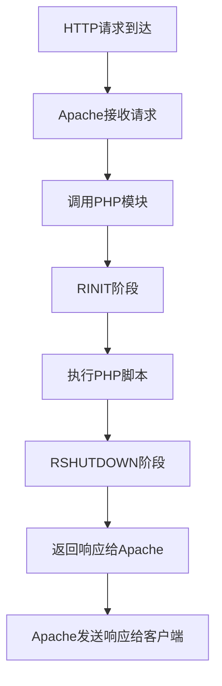
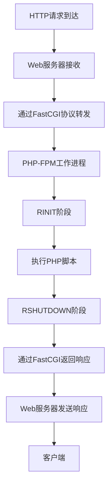
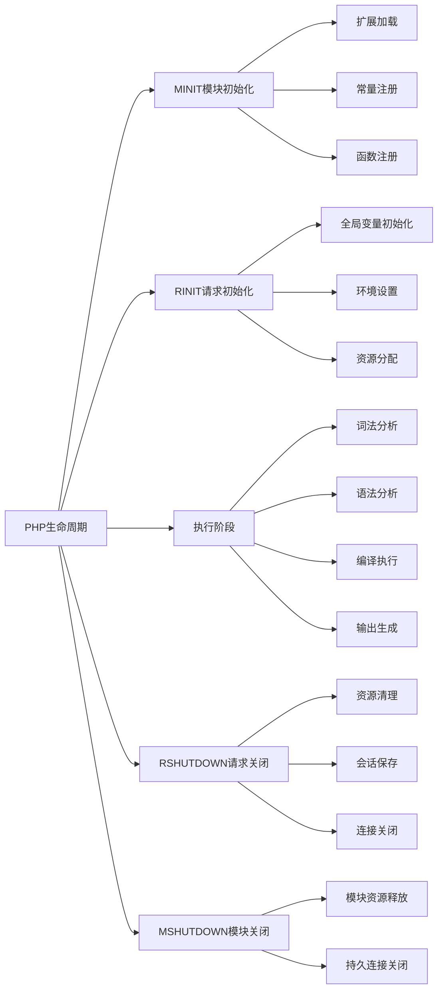

# 什么是PHP的生命周期？请求到达时发生了什么？

## 概要回答

PHP生命周期分为四个主要阶段：模块初始化阶段（MINIT）、请求初始化阶段（RINIT）、执行阶段和请求关闭阶段（RSHUTDOWN）、模块关闭阶段（MSHUTDOWN）。当请求到达时，PHP会依次经过RINIT、执行阶段和RSHUTDOWN，处理完请求后返回响应。

## 深度解析

### PHP生命周期概述

PHP的生命周期可以分为两种不同的模式：CLI模式和Web模式（如Apache模块或FastCGI）。虽然两种模式有一些差异，但基本的生命周期阶段是相同的。

### 四个主要阶段

#### 1. 模块初始化阶段（MINIT）
这是PHP启动时的第一个阶段，只执行一次。在这个阶段：
- 加载并初始化所有已启用的扩展模块
- 注册扩展中的常量、函数和类
- 执行扩展的初始化代码

```c
// C代码示例（扩展开发中）
PHP_MINIT_FUNCTION(my_extension) {
    // 注册常量
    REGISTER_LONG_CONSTANT("MY_CONSTANT", 123, CONST_CS | CONST_PERSISTENT);
    
    // 注册函数
    php_register_functions(my_functions);
    
    return SUCCESS;
}
```

#### 2. 请求初始化阶段（RINIT）
每当有新的HTTP请求到达时都会执行这个阶段：
- 初始化全局变量（$_GET、$_POST、$_SESSION等）
- 设置执行环境
- 初始化请求特定的资源

```c
// C代码示例
PHP_RINIT_FUNCTION(my_extension) {
    // 初始化请求特定的数据
    MY_G(request_data) = NULL;
    
    // 设置执行上下文
    // ...
    
    return SUCCESS;
}
```

#### 3. 执行阶段
这是PHP脚本实际执行的阶段：
- 词法分析和语法分析
- 编译成操作码（opcode）
- 执行操作码
- 生成输出

```php
<?php
// 这是执行阶段处理的PHP代码
echo "Hello World!";

function calculate($a, $b) {
    return $a + $b;
}

$result = calculate(5, 3);
echo "Result: $result";
?>
```

#### 4. 请求关闭阶段（RSHUTDOWN）
每个请求结束后都会执行：
- 清理请求期间分配的资源
- 关闭数据库连接
- 保存会话数据
- 发送HTTP响应头

```c
// C代码示例
PHP_RSHUTDOWN_FUNCTION(my_extension) {
    // 清理请求数据
    if (MY_G(request_data)) {
        efree(MY_G(request_data));
        MY_G(request_data) = NULL;
    }
    
    return SUCCESS;
}
```

#### 5. 模块关闭阶段（MSHUTDOWN）
当PHP进程终止时执行（如Web服务器重启）：
- 清理所有模块使用的资源
- 关闭持久化连接
- 执行最终清理工作

```c
// C代码示例
PHP_MSHUTDOWN_FUNCTION(my_extension) {
    // 清理模块资源
    // ...
    
    return SUCCESS;
}
```

### Web请求处理流程

当一个HTTP请求到达Web服务器时，完整的处理流程如下：

#### Apache模块模式（mod_php）


#### FastCGI模式（PHP-FPM）


### 请求处理详细步骤

当一个PHP请求到达时，具体会发生以下事情：

1. **请求接收**
   - Web服务器接收HTTP请求
   - 根据配置决定是否交给PHP处理

2. **环境初始化**
   - 创建请求上下文
   - 初始化超全局变量（$_SERVER、$_GET、$_POST等）
   - 设置错误处理和异常处理机制

3. **脚本编译**
   - 读取PHP源代码文件
   - 进行词法分析（Tokenizer）
   - 进行语法分析（Parser）
   - 生成操作码（Opcode）

4. **脚本执行**
   - Zend引擎逐条执行操作码
   - 处理变量、函数调用、类实例化等
   - 与扩展模块交互

5. **输出处理**
   - 收集脚本输出内容
   - 处理缓冲区（Output Buffering）
   - 发送HTTP头部信息

6. **资源清理**
   - 销毁局部变量
   - 关闭临时文件句柄
   - 清理请求特定的数据结构

### 性能优化考虑

理解PHP生命周期对性能优化非常重要：

#### 1. Opcode缓存
```php
<?php
// 使用OPcache可以跳过编译阶段
// 直接执行已缓存的操作码
opcache_enable();
?>
```

#### 2. 持久化连接
```php
<?php
// 在MINIT阶段建立持久化连接
// 避免每次请求都建立新连接
$pdo = new PDO($dsn, $user, $pass, [
    PDO::ATTR_PERSISTENT => true
]);
?>
```

#### 3. 减少RINIT/RSHUTDOWN开销
```php
<?php
// 避免在脚本中做过多的初始化工作
// 将一些初始化工作移到扩展中进行
?>
```

### 不同运行模式的差异

#### CLI模式
- MINIT和MSHUTDOWN只执行一次
- 每个脚本执行都是一次完整的请求周期
- 没有并发请求的概念

#### Web模式
- MINIT和MSHUTDOWN在进程生命周期内只执行一次
- RINIT和RSHUTDOWN为每个HTTP请求执行
- 需要考虑并发和资源共享问题

## 图形化表达

