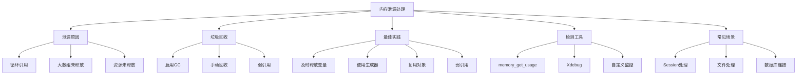

# 如何处理PHP中的内存泄漏问题？

## 概要回答

PHP中的内存泄漏主要来源于循环引用、大数组未释放、对象持有资源未释放等问题。可以通过启用垃圾回收机制、及时释放大变量、避免循环引用、使用弱引用等方式来处理内存泄漏问题。同时借助Xdebug等工具可以检测和定位内存泄漏。

## 深度解析

### 内存泄漏的原因

PHP作为一种托管内存的语言，大部分内存管理由Zend引擎自动处理。但在某些情况下仍可能出现内存泄漏：

#### 1. 循环引用
```php
<?php
// 循环引用示例
class Node {
    public $data;
    public $next;
    public $prev;
    
    public function __construct($data) {
        $this->data = $data;
    }
}

// 创建循环引用
$node1 = new Node("节点1");
$node2 = new Node("节点2");
$node1->next = $node2;
$node2->prev = $node1;

// 即使变量超出作用域，由于循环引用，内存可能不会立即释放
// 在PHP 5.3之前的版本中这是一个严重问题
?>
```

#### 2. 大数组未释放
```php
<?php
// 处理大文件时未及时释放内存
function processLargeFile($filename) {
    $data = file_get_contents($filename);
    $lines = explode("\n", $data);
    
    // 处理大量数据
    foreach ($lines as $line) {
        // 处理每一行
    }
    
    // 忘记释放$data和$lines变量
    // 在函数结束前应该及时释放大变量
    unset($data, $lines);
}
?>
```

#### 3. 对象持有资源未释放
```php
<?php
class DatabaseConnection {
    private $connection;
    
    public function __construct() {
        $this->connection = mysqli_connect("localhost", "user", "pass", "db");
    }
    
    // 缺少析构函数来释放连接
    // public function __destruct() {
    //     if ($this->connection) {
    //         mysqli_close($this->connection);
    //     }
    // }
}

$db = new DatabaseConnection();
// 如果没有析构函数，数据库连接可能不会被及时释放
?>
```

### PHP垃圾回收机制

#### 启用垃圾回收
```php
<?php
// PHP 5.3+引入了循环垃圾回收器
gc_enable();  // 启用垃圾回收（默认已启用）
var_dump(gc_enabled()); // 检查是否启用

// 手动触发垃圾回收
gc_collect_cycles();

// 获取垃圾回收状态
var_dump(gc_status());
?>
```

#### 垃圾回收的工作原理
```php
<?php
// 垃圾回收主要处理循环引用
$a = new stdClass();
$b = new stdClass();
$a->ref = $b;
$b->ref = $a;

// 此时$a和$b互相引用，形成循环
unset($a, $b);  // 断开变量引用

// 垃圾回收器会检测到这种循环引用并清理内存
gc_collect_cycles();  // 手动触发回收
?>
```

### 内存管理最佳实践

#### 1. 及时释放大变量
```php
<?php
function processData() {
    // 处理大数据
    $largeData = loadLargeDataset();
    
    // 处理数据
    $result = process($largeData);
    
    // 及时释放大变量
    unset($largeData);
    
    return $result;
}

function loadLargeDataset() {
    // 模拟加载大量数据
    return range(1, 1000000);
}

function process($data) {
    // 处理数据
    return count($data);
}
?>
```

#### 2. 使用生成器处理大数据
```php
<?php
// 不好的做法：一次性加载所有数据
function loadAllUsersBad() {
    $users = [];
    for ($i = 0; $i < 1000000; $i++) {
        $users[] = ['id' => $i, 'name' => "User $i"];
    }
    return $users;
}

// 好的做法：使用生成器
function loadAllUsersGood() {
    for ($i = 0; $i < 1000000; $i++) {
        yield ['id' => $i, 'name' => "User $i"];
    }
}

// 使用生成器可以大大减少内存占用
foreach (loadAllUsersGood() as $user) {
    // 处理单个用户
    if ($user['id'] > 10) break;  // 可以随时中断
}
?>
```

#### 3. 避免不必要的对象创建
```php
<?php
class UserManager {
    // 不好的做法：每次都创建新对象
    public function getUserBad($id) {
        $db = new Database();  // 每次都创建新连接
        return $db->findUser($id);
    }
    
    // 好的做法：复用对象
    private $db;
    
    public function __construct() {
        $this->db = new Database();  // 只创建一次
    }
    
    public function getUserGood($id) {
        return $this->db->findUser($id);
    }
}
?>
```

#### 4. 使用弱引用（PHP 7.4+）
```php
<?php
// 弱引用允许引用对象而不阻止其被销毁
class Cache {
    private $cache = [];
    
    public function set($key, $value) {
        // 使用弱引用存储对象
        $this->cache[$key] = WeakReference::create($value);
    }
    
    public function get($key) {
        if (!isset($this->cache[$key])) {
            return null;
        }
        
        $reference = $this->cache[$key];
        return $reference->get();  // 返回对象或null（如果已被销毁）
    }
}

$obj = new stdClass();
$cache = new Cache();
$cache->set('my_object', $obj);

echo "对象是否存在: " . ($cache->get('my_object') ? '是' : '否') . "\n";  // 是

unset($obj);  // 销毁原始对象

echo "对象是否存在: " . ($cache->get('my_object') ? '是' : '否') . "\n";  // 否
?>
```

### 内存泄漏检测工具

#### 1. 使用memory_get_usage()
```php
<?php
function debugMemory($point = '') {
    echo "内存使用情况 ($point): " . memory_get_usage() . " bytes\n";
    echo "实际内存使用: " . memory_get_usage(true) . " bytes\n";
    echo "峰值内存使用: " . memory_get_peak_usage() . " bytes\n";
    echo "实际峰值内存: " . memory_get_peak_usage(true) . " bytes\n\n";
}

debugMemory('开始');

// 创建大量数据
$data = range(1, 100000);
debugMemory('创建数据后');

// 释放数据
unset($data);
debugMemory('释放数据后');

// 强制垃圾回收
gc_collect_cycles();
debugMemory('垃圾回收后');
?>
```

#### 2. 使用Xdebug分析内存
```php
<?php
// 需要安装Xdebug扩展
if (extension_loaded('xdebug')) {
    // 开始函数追踪
    xdebug_start_trace('/tmp/trace.xt');
    
    // 执行可能有问题的代码
    problematicFunction();
    
    // 结束追踪
    xdebug_stop_trace();
}

function problematicFunction() {
    $data = [];
    for ($i = 0; $i < 10000; $i++) {
        $data[] = str_repeat('x', 1000);
    }
    // 忘记释放$data
}
?>
```

#### 3. 自定义内存监控类
```php
<?php
class MemoryMonitor {
    private $checkpoints = [];
    
    public function checkpoint($name) {
        $this->checkpoints[$name] = [
            'memory' => memory_get_usage(),
            'real_memory' => memory_get_usage(true),
            'peak' => memory_get_peak_usage(),
            'time' => microtime(true)
        ];
    }
    
    public function report() {
        echo "内存使用报告:\n";
        echo str_repeat('-', 80) . "\n";
        
        $previous = null;
        foreach ($this->checkpoints as $name => $data) {
            echo "检查点: $name\n";
            echo "  内存使用: " . $this->formatBytes($data['memory']) . "\n";
            
            if ($previous) {
                $diff = $data['memory'] - $previous['memory'];
                echo "  内存变化: " . ($diff > 0 ? '+' : '') . $this->formatBytes($diff) . "\n";
            }
            
            echo "  峰值内存: " . $this->formatBytes($data['peak']) . "\n";
            echo "  时间戳: " . date('Y-m-d H:i:s', $data['time']) . "\n\n";
            
            $previous = $data;
        }
    }
    
    private function formatBytes($bytes) {
        $units = ['B', 'KB', 'MB', 'GB'];
        $bytes = max($bytes, 0);
        $pow = floor(($bytes ? log($bytes) : 0) / log(1024));
        $pow = min($pow, count($units) - 1);
        $bytes /= pow(1024, $pow);
        return round($bytes, 2) . ' ' . $units[$pow];
    }
}

// 使用示例
$monitor = new MemoryMonitor();
$monitor->checkpoint('开始');

$data = [];
for ($i = 0; $i < 100000; $i++) {
    $data[] = ['id' => $i, 'value' => str_repeat('x', 100)];
}

$monitor->checkpoint('数据加载完成');

unset($data);
$monitor->checkpoint('数据释放完成');

gc_collect_cycles();
$monitor->checkpoint('垃圾回收完成');

$monitor->report();
?>
```

### 常见内存泄漏场景及解决方案

#### 1. Session处理不当
```php
<?php
// 不好的做法
session_start();
$_SESSION['large_data'] = loadLargeData();  // 将大量数据存储在Session中

// 好的做法
session_start();
// 只存储必要的标识符，而不是实际数据
$_SESSION['user_id'] = $userId;
// 实际数据应该从数据库或其他存储中按需加载
?>
```

#### 2. 文件处理未关闭
```php
<?php
// 不好的做法
$file = fopen('large_file.txt', 'r');
while (!feof($file)) {
    $line = fgets($file);
    // 处理行数据
}
// 忘记关闭文件

// 好的做法
$file = fopen('large_file.txt', 'r');
if ($file) {
    try {
        while (!feof($file)) {
            $line = fgets($file);
            // 处理行数据
        }
    } finally {
        fclose($file);  // 确保文件被关闭
    }
}
?>
```

## 图形化表达

