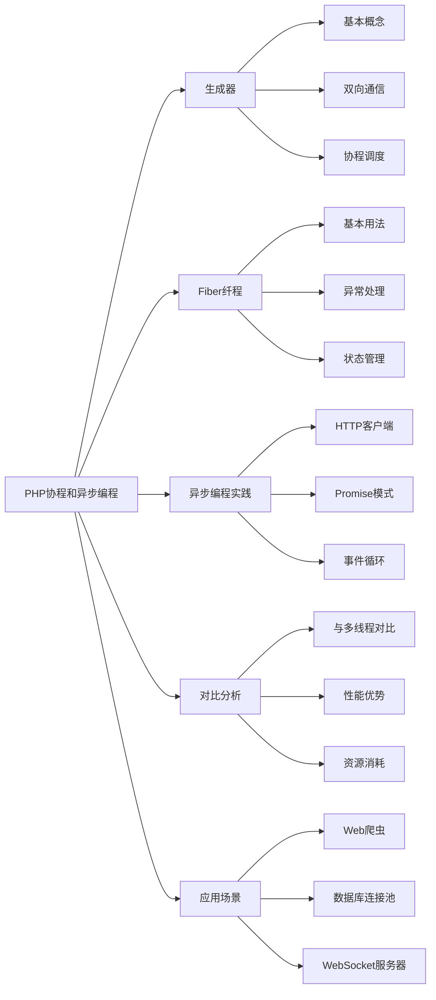

# 解释PHP中的协程和异步编程？

## 概要回答

PHP中的协程是一种轻量级的并发编程方式，允许在单个线程中通过yield关键字暂停和恢复执行。PHP 8.1引入了原生纤程（Fiber）支持，提供了更强大的异步编程能力。协程相比传统多线程具有更低的资源消耗和更好的可控性。

## 深度解析

### 协程的基本概念

协程是一种比线程更加轻量级的存在，一个线程可以包含多个协程。协程的调度完全由用户控制，而不是操作系统。在PHP中，协程主要通过Generator（生成器）和Fiber（纤程）来实现。

### Generator生成器

生成器是PHP 5.5引入的特性，它是实现协程的基础。

#### 基本用法
```php
<?php
function simpleGenerator() {
    yield 1;
    yield 2;
    yield 3;
}

foreach (simpleGenerator() as $value) {
    echo $value . "\n";
}
// 输出:
// 1
// 2
// 3
?>
```

#### 带键值的生成器
```php
<?php
function keyValueGenerator() {
    yield 'first' => 1;
    yield 'second' => 2;
    yield 'third' => 3;
}

foreach (keyValueGenerator() as $key => $value) {
    echo "$key: $value\n";
}
// 输出:
// first: 1
// second: 2
// third: 3
?>
```

#### 生成器中的双向通信
```php
<?php
function communicationGenerator() {
    $value = yield;  // 接收发送的值
    echo "接收到: $value\n";
    
    $value2 = yield "返回值";  // 发送返回值并接收新值
    echo "再次接收到: $value2\n";
}

$gen = communicationGenerator();
$gen->current();  // 启动生成器
$gen->send("Hello");  // 发送值
$returnValue = $gen->send("World");  // 发送值并获取返回值
echo "返回值: $returnValue\n";

// 输出:
// 接收到: Hello
// 再次接收到: World
// 返回值: 返回值
?>
```

### 使用生成器实现协程

#### 简单的协程调度器
```php
<?php
class CoroutineScheduler {
    protected $queue;
    
    public function __construct() {
        $this->queue = new SplQueue();
    }
    
    public function addCoroutine(Generator $coroutine) {
        $this->queue->enqueue($coroutine);
    }
    
    public function run() {
        while (!$this->queue->isEmpty()) {
            $coroutine = $this->queue->dequeue();
            
            if (!$coroutine->valid()) {
                continue;
            }
            
            $coroutine->next();
            
            if ($coroutine->valid()) {
                $this->queue->enqueue($coroutine);
            }
        }
    }
}

function task1() {
    for ($i = 1; $i <= 3; $i++) {
        echo "任务1: $i\n";
        yield;
    }
}

function task2() {
    for ($i = 1; $i <= 3; $i++) {
        echo "任务2: $i\n";
        yield;
    }
}

$scheduler = new CoroutineScheduler();
$scheduler->addCoroutine(task1());
$scheduler->addCoroutine(task2());
$scheduler->run();

// 输出:
// 任务1: 1
// 任务2: 1
// 任务1: 2
// 任务2: 2
// 任务1: 3
// 任务2: 3
?>
```

### Fiber纤程（PHP 8.1+）

Fiber是PHP 8.1引入的原生协程支持，提供了更强大和灵活的异步编程能力。

#### 基本用法
```php
<?php
$fiber = new Fiber(function (): void {
    echo "纤程开始\n";
    Fiber::suspend("从纤程返回的值");
    echo "纤程结束\n";
});

echo "启动纤程\n";
$value = $fiber->start();
echo "从纤程接收到: $value\n";

echo "恢复纤程\n";
$fiber->resume("传递给纤程的值");

// 输出:
// 启动纤程
// 纤程开始
// 从纤程接收到: 从纤程返回的值
// 恢复纤程
// 纤程结束
?>
```

#### 异常处理
```php
<?php
$fiber = new Fiber(function (): void {
    echo "纤程开始\n";
    try {
        Fiber::suspend("挂起");
    } catch (Exception $e) {
        echo "纤程中捕获异常: " . $e->getMessage() . "\n";
    }
    echo "纤程结束\n";
});

$fiber->start();
$fiber->throw(new Exception("抛出异常"));

// 输出:
// 纤程开始
// 纤程中捕获异常: 抛出异常
// 纤程结束
?>
```

### 异步编程实践

#### 模拟异步HTTP请求
```php
<?php
class AsyncHttpClient {
    private $requests = [];
    
    public function get($url) {
        // 模拟异步请求
        $fiber = Fiber::getCurrent();
        if ($fiber) {
            // 模拟异步操作
            $this->requests[] = [
                'fiber' => $fiber,
                'url' => $url,
                'result' => "响应内容 from $url"
            ];
            
            // 挂起当前纤程，等待结果
            return Fiber::suspend();
        } else {
            // 同步处理
            return "同步响应 from $url";
        }
    }
    
    public function execute() {
        foreach ($this->requests as $request) {
            // 模拟异步完成
            $request['fiber']->resume($request['result']);
        }
    }
}

// 使用示例
$fiber1 = new Fiber(function () {
    $client = new AsyncHttpClient();
    $response = $client->get('http://example.com/api1');
    echo "API1响应: $response\n";
});

$fiber2 = new Fiber(function () {
    $client = new AsyncHttpClient();
    $response = $client->get('http://example.com/api2');
    echo "API2响应: $response\n";
});

$fiber1->start();
$fiber2->start();

$client = new AsyncHttpClient();
$client->execute();

// 输出:
// API1响应: 响应内容 from http://example.com/api1
// API2响应: 响应内容 from http://example.com/api2
?>
```

#### Promise模式实现
```php
<?php
class Promise {
    private $fiber;
    private $result;
    private $resolved = false;
    
    public function __construct(callable $executor) {
        $this->fiber = new Fiber(function () use ($executor) {
            $resolve = function ($value) {
                $this->result = $value;
                $this->resolved = true;
                if (Fiber::getCurrent()) {
                    Fiber::suspend($value);
                }
            };
            
            $executor($resolve);
        });
    }
    
    public function then(callable $callback) {
        if (!$this->resolved) {
            $this->fiber->start();
        }
        
        return $callback($this->result);
    }
}

// 使用示例
$promise = new Promise(function ($resolve) {
    // 模拟异步操作
    sleep(1);
    $resolve("异步操作完成");
});

echo "开始异步操作\n";
$result = $promise->then(function ($value) {
    return "处理结果: $value";
});
echo $result . "\n";

// 输出:
// 开始异步操作
// 处理结果: 异步操作完成
?>
```

### 协程与传统多线程的对比

| 特性 | 协程 | 多线程 |
|------|------|--------|
| 资源消耗 | 极低（KB级） | 较高（MB级） |
| 上下文切换 | 用户态，无系统调用 | 内核态，有系统调用 |
| 并发数量 | 可以很高（万级以上） | 受限于系统资源 |
| 数据共享 | 简单（同一进程） | 复杂（需要同步机制） |
| 调度控制 | 用户完全控制 | 操作系统控制 |

### 实际应用场景

#### 1. Web爬虫
```php
<?php
class WebCrawler {
    private $urls = [];
    private $results = [];
    
    public function addUrl($url) {
        $this->urls[] = $url;
    }
    
    public function crawl() {
        $fibers = [];
        
        foreach ($this->urls as $url) {
            $fiber = new Fiber(function () use ($url) {
                // 模拟HTTP请求
                echo "开始抓取: $url\n";
                usleep(500000);  // 模拟网络延迟
                $content = "内容 from $url";
                echo "完成抓取: $url\n";
                return $content;
            });
            
            $fibers[] = $fiber;
            $fiber->start();
        }
        
        // 收集结果
        foreach ($fibers as $fiber) {
            $this->results[] = $fiber->getReturn();
        }
        
        return $this->results;
    }
}

$crawler = new WebCrawler();
$crawler->addUrl('http://example1.com');
$crawler->addUrl('http://example2.com');
$crawler->addUrl('http://example3.com');

$start = microtime(true);
$results = $crawler->crawl();
$end = microtime(true);

echo "总耗时: " . ($end - $start) . " 秒\n";
print_r($results);
?>
```

#### 2. 数据库连接池
```php
<?php
class ConnectionPool {
    private $connections = [];
    private $available = [];
    private $maxConnections = 5;
    
    public function getConnection() {
        if (!empty($this->available)) {
            return array_pop($this->available);
        }
        
        if (count($this->connections) < $this->maxConnections) {
            $connection = new DatabaseConnection();
            $this->connections[] = $connection;
            return $connection;
        }
        
        // 如果没有可用连接，挂起直到有连接可用
        return Fiber::suspend(function () {
            return $this->getConnection();
        });
    }
    
    public function releaseConnection($connection) {
        $this->available[] = $connection;
    }
}

class DatabaseConnection {
    public function query($sql) {
        // 模拟数据库查询
        usleep(100000);  // 模拟查询时间
        return "查询结果: $sql";
    }
}
?>
```

### 性能优势

协程相比传统同步编程和多线程编程具有明显优势：

1. **低资源消耗**：每个协程只需要几KB的内存
2. **高并发能力**：单个线程可以运行成千上万个协程
3. **简化编程模型**：避免了复杂的回调嵌套
4. **更好的可控性**：用户可以精确控制协程的执行时机

### 注意事项

1. **错误处理**：协程中的异常需要特别处理
2. **状态管理**：协程间的状态共享需要谨慎设计
3. **调试困难**：协程的调试比传统代码更复杂
4. **兼容性**：需要PHP 8.1+才能使用Fiber

## 图形化表达

