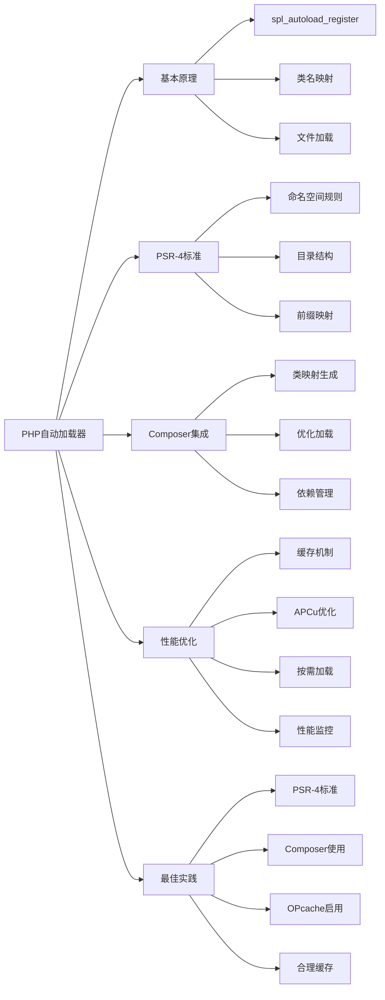

# 如何实现一个高效的PHP自动加载器？

## 概要回答

PHP自动加载器通过`spl_autoload_register()`函数注册，可以根据类名自动加载对应的PHP文件。高效的自动加载器应遵循PSR-4标准，结合Composer的类映射，避免不必要的文件系统操作，并支持缓存机制来提升性能。

## 深度解析

### 自动加载器的基本原理

PHP自动加载器的核心机制是当代码尝试使用尚未定义的类时，PHP会自动调用预先注册的加载函数来加载该类的定义文件。

#### 基本实现
```php
<?php
// 最简单的自动加载器
function autoload($className) {
    $file = $className . '.php';
    if (file_exists($file)) {
        require_once $file;
    }
}

// 注册自动加载器
spl_autoload_register('autoload');

// 使用未包含的类
$obj = new MyClass();  // 会自动加载 MyClass.php
?>
```

### PSR-4标准自动加载器

PSR-4是现代PHP项目广泛采用的自动加载标准，它定义了类名与文件路径之间的映射关系。

#### PSR-4规则
1. 类名必须与文件名一致
2. 命名空间必须与目录结构对应
3. 基础目录可以映射到命名空间前缀

```php
<?php
class Psr4Autoloader {
    private $prefixes = [];
    
    /**
     * 添加命名空间前缀与基础目录的映射
     */
    public function addNamespace($prefix, $baseDir, $prepend = false) {
        // 规范化命名空间前缀
        $prefix = trim($prefix, '\\') . '\\';
        
        // 规范化基础目录
        $baseDir = rtrim($baseDir, DIRECTORY_SEPARATOR) . '/';
        
        // 初始化命名空间前缀数组
        if (!isset($this->prefixes[$prefix])) {
            $this->prefixes[$prefix] = [];
        }
        
        // 保留基础目录
        if ($prepend) {
            array_unshift($this->prefixes[$prefix], $baseDir);
        } else {
            array_push($this->prefixes[$prefix], $baseDir);
        }
    }
    
    /**
     * 加载类文件
     */
    public function loadClass($class) {
        // 当前命名空间前缀
        $prefix = $class;
        
        // 从后面开始遍历完全限定类名来查找匹配的前缀
        while (false !== $pos = strrpos($prefix, '\\')) {
            // 保留前缀中尾部的分隔符
            $prefix = substr($class, 0, $pos + 1);
            
            // 剩余部分是相关的类名
            $relativeClass = substr($class, $pos + 1);
            
            // 尝试加载前缀对应的文件
            $mappedFile = $this->loadMappedFile($prefix, $relativeClass);
            if ($mappedFile) {
                return $mappedFile;
            }
            
            // 删除尾部的分隔符以进行下一次迭代
            $prefix = rtrim($prefix, '\\');
        }
        
        // 未找到文件
        return false;
    }
    
    /**
     * 加载映射文件
     */
    protected function loadMappedFile($prefix, $relativeClass) {
        // 命名空间前缀是否存在映射
        if (!isset($this->prefixes[$prefix])) {
            return false;
        }
        
        // 遍历基础目录
        foreach ($this->prefixes[$prefix] as $baseDir) {
            // 替换命名空间前缀为基准目录
            // 替换命名空间分隔符为目录分隔符
            // 添加.php后缀
            $file = $baseDir
                  . str_replace('\\', '/', $relativeClass)
                  . '.php';
            
            // 如果映射文件存在则引入
            if ($this->requireFile($file)) {
                return $file;
            }
        }
        
        // 未找到文件
        return false;
    }
    
    /**
     * 如果文件存在则引入
     */
    protected function requireFile($file) {
        if (file_exists($file)) {
            require $file;
            return true;
        }
        return false;
    }
}

// 使用示例
$loader = new Psr4Autoloader();
$loader->addNamespace('App\\Models', __DIR__ . '/src/Models');
$loader->addNamespace('App\\Controllers', __DIR__ . '/src/Controllers');

// 注册自动加载器
spl_autoload_register([$loader, 'loadClass']);
?>
```

### Composer自动加载器

Composer是PHP生态系统中最流行的依赖管理工具，它提供了高效的自动加载机制。

#### 类映射生成器
```php
<?php
// composer.json配置
/*
{
    "autoload": {
        "psr-4": {
            "App\\": "src/"
        },
        "classmap": [
            "database/seeds",
            "database/factories"
        ]
    }
}
*/

// Composer生成的类映射示例
$classMap = [
    'App\\Models\\User' => '/path/to/src/Models/User.php',
    'App\\Controllers\\UserController' => '/path/to/src/Controllers/UserController.php',
];

class ComposerAutoloader {
    private $classMap = [];
    private $fallbackDirsPsr4 = [];
    private $prefixesPsr4 = [];
    
    public function __construct($classMap) {
        $this->classMap = $classMap;
    }
    
    public function loadClass($class) {
        // 首先检查类映射
        if (isset($this->classMap[$class])) {
            require $this->classMap[$class];
            return true;
        }
        
        // PSR-4加载
        return $this->loadClassPsr4($class);
    }
    
    private function loadClassPsr4($class) {
        // PSR-4加载逻辑
        $logicalPathPsr4 = strtr($class, '\\', DIRECTORY_SEPARATOR) . '.php';
        
        $first = $class[0];
        if (isset($this->prefixLengthsPsr4[$first])) {
            foreach ($this->prefixLengthsPsr4[$first] as $prefix => $length) {
                if (0 === strpos($class, $prefix)) {
                    foreach ($this->prefixDirsPsr4[$prefix] as $dir) {
                        $file = $dir . DIRECTORY_SEPARATOR . substr($logicalPathPsr4, $length);
                        if (file_exists($file)) {
                            require $file;
                            return true;
                        }
                    }
                }
            }
        }
        
        // 遍历后备目录
        foreach ($this->fallbackDirsPsr4 as $dir) {
            $file = $dir . DIRECTORY_SEPARATOR . $logicalPathPsr4;
            if (file_exists($file)) {
                require $file;
                return true;
            }
        }
        
        return false;
    }
}
?>
```

### 高效自动加载器的优化策略

#### 1. 缓存机制
```php
<?php
class CachedAutoloader {
    private $cacheFile;
    private $classMap = [];
    private $cacheEnabled = true;
    
    public function __construct($cacheFile = null) {
        $this->cacheFile = $cacheFile ?: sys_get_temp_dir() . '/autoload_cache.php';
        $this->loadCache();
    }
    
    public function registerClass($class, $file) {
        $this->classMap[$class] = $file;
    }
    
    public function loadClass($class) {
        if (isset($this->classMap[$class])) {
            require $this->classMap[$class];
            return true;
        }
        
        return false;
    }
    
    public function buildCache() {
        // 扫描目录构建类映射
        $this->scanDirectories();
        
        // 保存缓存
        $this->saveCache();
    }
    
    private function scanDirectories() {
        $directories = [
            __DIR__ . '/src',
            __DIR__ . '/app'
        ];
        
        foreach ($directories as $directory) {
            $iterator = new RecursiveIteratorIterator(
                new RecursiveDirectoryIterator($directory)
            );
            
            foreach ($iterator as $file) {
                if ($file->isFile() && $file->getExtension() === 'php') {
                    $className = $this->extractClassName($file->getPathname());
                    if ($className) {
                        $this->classMap[$className] = $file->getPathname();
                    }
                }
            }
        }
    }
    
    private function extractClassName($file) {
        $content = file_get_contents($file);
        if (preg_match('/namespace\s+([^;]+);/', $content, $namespaceMatches) &&
            preg_match('/class\s+(\w+)/', $content, $classMatches)) {
            return $namespaceMatches[1] . '\\' . $classMatches[1];
        }
        return null;
    }
    
    private function loadCache() {
        if ($this->cacheEnabled && file_exists($this->cacheFile)) {
            $this->classMap = include $this->cacheFile;
        }
    }
    
    private function saveCache() {
        if ($this->cacheEnabled) {
            $export = var_export($this->classMap, true);
            file_put_contents($this->cacheFile, "<?php\nreturn $export;");
        }
    }
    
    public function enableCache($enable = true) {
        $this->cacheEnabled = $enable;
    }
}

// 使用示例
$autoloader = new CachedAutoloader(__DIR__ . '/cache/autoload.php');
$autoloader->buildCache();  // 首次运行时构建缓存
spl_autoload_register([$autoloader, 'loadClass']);
?>
```

#### 2. APCu缓存优化
```php
<?php
class ApcuCachedAutoloader {
    private $prefix = 'autoloader_';
    private $ttl = 3600;  // 1小时
    
    public function loadClass($class) {
        $key = $this->prefix . $class;
        
        // 尝试从APCu缓存获取文件路径
        $file = apcu_fetch($key);
        if ($file === false) {
            // 缓存未命中，查找文件
            $file = $this->findFile($class);
            if ($file) {
                // 存储到APCu缓存
                apcu_store($key, $file, $this->ttl);
            }
        }
        
        if ($file && file_exists($file)) {
            require $file;
            return true;
        }
        
        return false;
    }
    
    private function findFile($class) {
        // 查找文件的逻辑
        // 这里简化处理，实际应该实现完整的查找逻辑
        $file = str_replace('\\', '/', $class) . '.php';
        $possiblePaths = [
            __DIR__ . '/src/' . $file,
            __DIR__ . '/app/' . $file
        ];
        
        foreach ($possiblePaths as $path) {
            if (file_exists($path)) {
                return $path;
            }
        }
        
        return false;
    }
}

// 检查APCu扩展是否可用
if (extension_loaded('apcu')) {
    $autoloader = new ApcuCachedAutoloader();
    spl_autoload_register([$autoloader, 'loadClass']);
} else {
    // 回退到普通自动加载器
    // ...
}
?>
```

#### 3. 按需加载优化
```php
<?php
class LazyAutoloader {
    private $namespaces = [];
    private $loadedFiles = [];
    
    public function addNamespace($namespace, $directory) {
        $this->namespaces[$namespace] = $directory;
    }
    
    public function loadClass($class) {
        // 检查是否已经加载过
        if (isset($this->loadedFiles[$class])) {
            return true;
        }
        
        // 检查类是否已定义
        if (class_exists($class, false) || interface_exists($class, false)) {
            $this->loadedFiles[$class] = true;
            return true;
        }
        
        // 查找并加载文件
        $file = $this->findFile($class);
        if ($file && file_exists($file)) {
            require $file;
            $this->loadedFiles[$class] = true;
            return true;
        }
        
        return false;
    }
    
    private function findFile($class) {
        foreach ($this->namespaces as $namespace => $directory) {
            if (strpos($class, $namespace) === 0) {
                $relativeClass = substr($class, strlen($namespace));
                $file = $directory . str_replace('\\', '/', $relativeClass) . '.php';
                return $file;
            }
        }
        
        return false;
    }
    
    // 预加载常用类
    public function preloadClasses($classes) {
        foreach ($classes as $class) {
            $this->loadClass($class);
        }
    }
}

// 使用示例
$autoloader = new LazyAutoloader();
$autoloader->addNamespace('App\\', __DIR__ . '/src/');
$autoloader->addNamespace('Vendor\\', __DIR__ . '/vendor/');

// 预加载框架核心类
$autoloader->preloadClasses([
    'App\\Http\\Kernel',
    'App\\Routing\\Router',
    'App\\Database\\Connection'
]);

spl_autoload_register([$autoloader, 'loadClass']);
?>
```

### 性能监控和调试

#### 自动加载器性能分析
```php
<?php
class ProfilingAutoloader {
    private $loader;
    private $stats = [
        'loads' => 0,
        'cache_hits' => 0,
        'files_loaded' => [],
        'load_times' => []
    ];
    
    public function __construct($loader) {
        $this->loader = $loader;
    }
    
    public function loadClass($class) {
        $this->stats['loads']++;
        $startTime = microtime(true);
        
        $result = $this->loader->loadClass($class);
        
        $loadTime = microtime(true) - $startTime;
        $this->stats['load_times'][] = $loadTime;
        
        if ($result) {
            $this->stats['files_loaded'][] = $class;
        }
        
        return $result;
    }
    
    public function getStats() {
        return [
            'total_loads' => $this->stats['loads'],
            'average_load_time' => count($this->stats['load_times']) ? 
                array_sum($this->stats['load_times']) / count($this->stats['load_times']) : 0,
            'slowest_load' => count($this->stats['load_times']) ? 
                max($this->stats['load_times']) : 0,
            'loaded_classes' => $this->stats['files_loaded']
        ];
    }
    
    public function __destruct() {
        if (defined('DEBUG_AUTOLOAD') && DEBUG_AUTOLOAD) {
            $stats = $this->getStats();
            error_log("自动加载器统计: " . json_encode($stats));
        }
    }
}

// 使用示例
$baseLoader = new Psr4Autoloader();
// ... 配置基础加载器 ...

$profilingLoader = new ProfilingAutoloader($baseLoader);
spl_autoload_register([$profilingLoader, 'loadClass']);

// 在应用结束时输出统计信息
register_shutdown_function(function() use ($profilingLoader) {
    print_r($profilingLoader->getStats());
});
?>
```

### 最佳实践建议

1. **遵循PSR-4标准**：确保类名与文件路径一致
2. **使用Composer**：利用成熟的自动加载机制
3. **启用OPcache**：提升文件包含性能
4. **合理使用缓存**：避免重复的文件系统操作
5. **监控性能**：定期分析自动加载器的性能表现
6. **避免过度预加载**：只预加载真正需要的类

## 图形化表达

