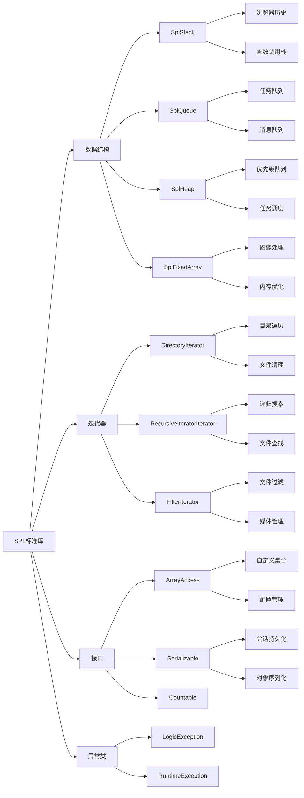

# PHP中的SPL标准库你用过哪些？具体应用场景是什么？

## 概要回答

PHP SPL（Standard PHP Library）提供了丰富的数据结构、迭代器和接口。常用的包括：
- **数据结构**：SplStack、SplQueue、SplHeap、SplFixedArray
- **迭代器**：DirectoryIterator、RecursiveIteratorIterator、FilterIterator
- **接口**：Countable、ArrayAccess、Serializable
- **异常类**：LogicException、RuntimeException等

这些组件在实际开发中广泛应用于队列处理、树形结构遍历、自定义数据集合等场景。

## 深度解析

### SPL数据结构

#### 1. SplStack（栈）
栈是一种后进先出（LIFO）的数据结构。

```php
<?php
// 使用SplStack实现函数调用栈
$stack = new SplStack();

// 压入元素
$stack->push('function1');
$stack->push('function2');
$stack->push('function3');

echo "栈顶元素: " . $stack->top() . "\n";  // function3

// 弹出元素
while (!$stack->isEmpty()) {
    echo "弹出: " . $stack->pop() . "\n";
}

// 实际应用场景：浏览器历史记录
class BrowserHistory {
    private $history;
    
    public function __construct() {
        $this->history = new SplStack();
    }
    
    public function visitPage($url) {
        $this->history->push($url);
        echo "访问页面: $url\n";
    }
    
    public function goBack() {
        if (!$this->history->isEmpty()) {
            $currentPage = $this->history->pop();
            echo "返回上一页: $currentPage\n";
            return $currentPage;
        }
        echo "没有更多历史记录\n";
        return null;
    }
}

$browser = new BrowserHistory();
$browser->visitPage('首页');
$browser->visitPage('产品页');
$browser->visitPage('详情页');
$browser->goBack();  // 返回详情页
$browser->goBack();  // 返回产品页
?>
```

#### 2. SplQueue（队列）
队列是一种先进先出（FIFO）的数据结构。

```php
<?php
// 使用SplQueue实现任务队列
$queue = new SplQueue();

// 入队
$queue->enqueue('任务1');
$queue->enqueue('任务2');
$queue->enqueue('任务3');

echo "队列大小: " . $queue->count() . "\n";  // 3

// 出队
while (!$queue->isEmpty()) {
    echo "处理: " . $queue->dequeue() . "\n";
}

// 实际应用场景：消息队列模拟
class MessageQueue {
    private $queue;
    
    public function __construct() {
        $this->queue = new SplQueue();
    }
    
    public function publish($message) {
        $this->queue->enqueue([
            'id' => uniqid(),
            'message' => $message,
            'timestamp' => time()
        ]);
        echo "发布消息: $message\n";
    }
    
    public function consume() {
        if (!$this->queue->isEmpty()) {
            $message = $this->queue->dequeue();
            echo "消费消息: " . $message['message'] . "\n";
            return $message;
        }
        echo "队列为空\n";
        return null;
    }
    
    public function size() {
        return $this->queue->count();
    }
}

$messageQueue = new MessageQueue();
$messageQueue->publish('订单创建');
$messageQueue->publish('支付成功');
$messageQueue->publish('发货通知');

echo "队列大小: " . $messageQueue->size() . "\n";  // 3

$messageQueue->consume();  // 消费订单创建
$messageQueue->consume();  // 消费支付成功
?>
```

#### 3. SplHeap（堆）
堆是一种特殊的树形数据结构，SplMaxHeap实现最大堆，SplMinHeap实现最小堆。

```php
<?php
// 使用SplMaxHeap实现优先级队列
class PriorityTask extends SplMaxHeap {
    protected function compare($value1, $value2) {
        // 比较优先级，数字越大优先级越高
        return $value1['priority'] - $value2['priority'];
    }
}

$taskHeap = new PriorityTask();

// 添加任务（优先级越高越先执行）
$taskHeap->insert(['name' => '发送邮件', 'priority' => 1]);
$taskHeap->insert(['name' => '处理订单', 'priority' => 3]);
$taskHeap->insert(['name' => '备份数据', 'priority' => 2]);

echo "任务执行顺序:\n";
while (!$taskHeap->isEmpty()) {
    $task = $taskHeap->extract();
    echo "- " . $task['name'] . " (优先级: " . $task['priority'] . ")\n";
}

// 实际应用场景：任务调度系统
class TaskScheduler {
    private $taskQueue;
    
    public function __construct() {
        $this->taskQueue = new PriorityTask();
    }
    
    public function addTask($name, $priority, $executeTime = null) {
        $this->taskQueue->insert([
            'name' => $name,
            'priority' => $priority,
            'execute_time' => $executeTime ?: time()
        ]);
    }
    
    public function executeNextTask() {
        if (!$this->taskQueue->isEmpty()) {
            $task = $this->taskQueue->extract();
            echo "执行任务: " . $task['name'] . "\n";
            return $task;
        }
        return null;
    }
    
    public function getPendingTaskCount() {
        return $this->taskQueue->count();
    }
}

$scheduler = new TaskScheduler();
$scheduler->addTask('低优先级任务', 1);
$scheduler->addTask('高优先级任务', 5);
$scheduler->addTask('中优先级任务', 3);

echo "待执行任务数: " . $scheduler->getPendingTaskCount() . "\n";  // 3
$scheduler->executeNextTask();  // 执行高优先级任务
?>
```

#### 4. SplFixedArray（固定长度数组）
固定长度数组比普通数组更节省内存。

```php
<?php
// 比较普通数组和SplFixedArray的内存使用
$normalArray = range(1, 100000);
$fixedArray = SplFixedArray::fromArray($normalArray);

echo "普通数组内存使用: " . memory_get_usage() . " bytes\n";
echo "固定数组内存使用: " . memory_get_usage() . " bytes\n";

// 实际应用场景：图像处理中的像素数据
class ImageProcessor {
    private $width;
    private $height;
    private $pixels;
    
    public function __construct($width, $height) {
        $this->width = $width;
        $this->height = $height;
        // 使用固定数组存储像素数据，节省内存
        $this->pixels = new SplFixedArray($width * $height);
    }
    
    public function setPixel($x, $y, $color) {
        if ($x >= 0 && $x < $this->width && $y >= 0 && $y < $this->height) {
            $index = $y * $this->width + $x;
            $this->pixels[$index] = $color;
        }
    }
    
    public function getPixel($x, $y) {
        if ($x >= 0 && $x < $this->width && $y >= 0 && $y < $this->height) {
            $index = $y * $this->width + $x;
            return $this->pixels[$index];
        }
        return null;
    }
    
    public function getWidth() {
        return $this->width;
    }
    
    public function getHeight() {
        return $this->height;
    }
}

$image = new ImageProcessor(1920, 1080);  // 全高清图像
$image->setPixel(100, 50, '#FF0000');     // 设置红色像素
$color = $image->getPixel(100, 50);       // 获取像素颜色
echo "像素颜色: $color\n";                // #FF0000
?>
```

### SPL迭代器

#### 1. DirectoryIterator（目录迭代器）
用于遍历目录中的文件和子目录。

```php
<?php
// 遍历目录
try {
    $iterator = new DirectoryIterator(__DIR__);
    
    echo "目录内容:\n";
    foreach ($iterator as $file) {
        if ($file->isFile()) {
            echo "- 文件: " . $file->getFilename() . " (" . $file->getSize() . " bytes)\n";
        } elseif ($file->isDir() && !$file->isDot()) {
            echo "- 目录: " . $file->getFilename() . "\n";
        }
    }
} catch (Exception $e) {
    echo "错误: " . $e->getMessage() . "\n";
}

// 实际应用场景：文件清理工具
class FileCleaner {
    public function cleanEmptyDirectories($path) {
        $iterator = new RecursiveIteratorIterator(
            new RecursiveDirectoryIterator($path),
            RecursiveIteratorIterator::CHILD_FIRST
        );
        
        $deletedCount = 0;
        foreach ($iterator as $file) {
            if ($file->isDir() && !$file->isDot()) {
                // 检查目录是否为空
                if ($this->isDirectoryEmpty($file->getPathname())) {
                    rmdir($file->getPathname());
                    echo "删除空目录: " . $file->getPathname() . "\n";
                    $deletedCount++;
                }
            }
        }
        
        echo "共删除 $deletedCount 个空目录\n";
    }
    
    private function isDirectoryEmpty($dir) {
        $handle = opendir($dir);
        while (false !== ($entry = readdir($handle))) {
            if ($entry != "." && $entry != "..") {
                closedir($handle);
                return false;
            }
        }
        closedir($handle);
        return true;
    }
}

// $cleaner = new FileCleaner();
// $cleaner->cleanEmptyDirectories('/path/to/clean');
?>
```

#### 2. RecursiveIteratorIterator（递归迭代器）
用于递归遍历嵌套结构。

```php
<?php
// 递归遍历目录树
$recursiveIterator = new RecursiveIteratorIterator(
    new RecursiveDirectoryIterator(__DIR__),
    RecursiveIteratorIterator::SELF_FIRST
);

echo "递归目录遍历:\n";
foreach ($recursiveIterator as $file) {
    $indent = str_repeat("  ", $recursiveIterator->getDepth());
    echo $indent . $file->getFilename() . "\n";
}

// 实际应用场景：文件搜索工具
class FileSearcher {
    public function searchFiles($path, $pattern) {
        $results = [];
        
        $iterator = new RecursiveIteratorIterator(
            new RecursiveDirectoryIterator($path)
        );
        
        $regexIterator = new RegexIterator(
            $iterator,
            '/^.+' . preg_quote($pattern, '/') . '$/i',
            RecursiveRegexIterator::GET_MATCH
        );
        
        foreach ($regexIterator as $match) {
            $results[] = $match[0];
        }
        
        return $results;
    }
    
    public function findLargeFiles($path, $minSize) {
        $results = [];
        
        $iterator = new RecursiveIteratorIterator(
            new RecursiveDirectoryIterator($path)
        );
        
        foreach ($iterator as $file) {
            if ($file->isFile() && $file->getSize() > $minSize) {
                $results[] = [
                    'path' => $file->getPathname(),
                    'size' => $file->getSize()
                ];
            }
        }
        
        // 按大小排序
        usort($results, function($a, $b) {
            return $b['size'] - $a['size'];
        });
        
        return $results;
    }
}

$searcher = new FileSearcher();
// $phpFiles = $searcher->searchFiles(__DIR__, '.php');
// $largeFiles = $searcher->findLargeFiles(__DIR__, 1024 * 1024); // 大于1MB的文件
?>
```

#### 3. FilterIterator（过滤迭代器）
用于过滤迭代器中的元素。

```php
<?php
// 自定义过滤迭代器
class PhpFileFilter extends FilterIterator {
    public function accept() {
        return $this->current()->getExtension() === 'php';
    }
}

class ImageFileFilter extends FilterIterator {
    private $allowedExtensions = ['jpg', 'jpeg', 'png', 'gif'];
    
    public function accept() {
        $extension = strtolower($this->current()->getExtension());
        return in_array($extension, $this->allowedExtensions);
    }
}

// 使用过滤迭代器
$directoryIterator = new DirectoryIterator(__DIR__);
$phpFiles = new PhpFileFilter($directoryIterator);

echo "PHP文件列表:\n";
foreach ($phpFiles as $file) {
    echo "- " . $file->getFilename() . "\n";
}

// 实际应用场景：媒体文件管理器
class MediaManager {
    private $basePath;
    
    public function __construct($basePath) {
        $this->basePath = $basePath;
    }
    
    public function getImages($directory = '') {
        $path = $this->basePath . ($directory ? '/' . $directory : '');
        
        try {
            $iterator = new ImageFileFilter(
                new DirectoryIterator($path)
            );
            
            $images = [];
            foreach ($iterator as $file) {
                $images[] = [
                    'name' => $file->getFilename(),
                    'size' => $file->getSize(),
                    'modified' => $file->getMTime()
                ];
            }
            
            return $images;
        } catch (Exception $e) {
            return [];
        }
    }
    
    public function getFilesBySize($minSize, $maxSize) {
        class SizeFilter extends FilterIterator {
            private $minSize, $maxSize;
            
            public function __construct(Iterator $iterator, $minSize, $maxSize) {
                parent::__construct($iterator);
                $this->minSize = $minSize;
                $this->maxSize = $maxSize;
            }
            
            public function accept() {
                $file = $this->current();
                $size = $file->getSize();
                return $file->isFile() && $size >= $this->minSize && $size <= $this->maxSize;
            }
        }
        
        try {
            $iterator = new SizeFilter(
                new RecursiveIteratorIterator(
                    new RecursiveDirectoryIterator($this->basePath)
                ),
                $minSize,
                $maxSize
            );
            
            $files = [];
            foreach ($iterator as $file) {
                $files[] = [
                    'path' => $file->getPathname(),
                    'size' => $file->getSize()
                ];
            }
            
            return $files;
        } catch (Exception $e) {
            return [];
        }
    }
}

$mediaManager = new MediaManager(__DIR__);
// $images = $mediaManager->getImages();
// $mediumFiles = $mediaManager->getFilesBySize(1024, 1024*1024); // 1KB到1MB的文件
?>
```

### SPL接口

#### 1. ArrayAccess（数组访问接口）
让对象可以像数组一样访问。

```php
<?php
class Collection implements ArrayAccess, Countable, IteratorAggregate {
    private $items = [];
    
    public function offsetExists($offset) {
        return isset($this->items[$offset]);
    }
    
    public function offsetGet($offset) {
        return $this->items[$offset] ?? null;
    }
    
    public function offsetSet($offset, $value) {
        if (is_null($offset)) {
            $this->items[] = $value;
        } else {
            $this->items[$offset] = $value;
        }
    }
    
    public function offsetUnset($offset) {
        unset($this->items[$offset]);
    }
    
    public function count() {
        return count($this->items);
    }
    
    public function getIterator() {
        return new ArrayIterator($this->items);
    }
    
    // 自定义方法
    public function add($item) {
        $this->items[] = $item;
    }
    
    public function remove($index) {
        if (isset($this->items[$index])) {
            unset($this->items[$index]);
            // 重新索引数组
            $this->items = array_values($this->items);
        }
    }
}

// 使用示例
$collection = new Collection();
$collection[] = '第一个元素';
$collection[1] = '第二个元素';
$collection->add('第三个元素');

echo "集合大小: " . count($collection) . "\n";  // 3
echo "第一个元素: " . $collection[0] . "\n";    // 第一个元素

foreach ($collection as $index => $item) {
    echo "索引 $index: $item\n";
}

$collection->remove(1);  // 删除第二个元素
echo "删除后大小: " . count($collection) . "\n";  // 2

// 实际应用场景：配置管理器
class ConfigManager implements ArrayAccess {
    private $config = [];
    private $configFile;
    
    public function __construct($configFile) {
        $this->configFile = $configFile;
        $this->loadConfig();
    }
    
    private function loadConfig() {
        if (file_exists($this->configFile)) {
            $this->config = json_decode(file_get_contents($this->configFile), true) ?: [];
        }
    }
    
    public function saveConfig() {
        file_put_contents($this->configFile, json_encode($this->config, JSON_PRETTY_PRINT));
    }
    
    public function offsetExists($offset) {
        return isset($this->config[$offset]);
    }
    
    public function offsetGet($offset) {
        return $this->config[$offset] ?? null;
    }
    
    public function offsetSet($offset, $value) {
        if (is_null($offset)) {
            $this->config[] = $value;
        } else {
            $this->config[$offset] = $value;
        }
        $this->saveConfig();  // 自动保存
    }
    
    public function offsetUnset($offset) {
        unset($this->config[$offset]);
        $this->saveConfig();  // 自动保存
    }
}

// $config = new ConfigManager('config.json');
// $config['database_host'] = 'localhost';
// $config['database_port'] = 3306;
// echo $config['database_host'];  // localhost
?>
```

#### 2. Serializable（序列化接口）
自定义序列化和反序列化行为。

```php
<?php
class DatabaseConnection implements Serializable {
    private $host;
    private $username;
    private $password;
    private $connection;  // 不能序列化
    
    public function __construct($host, $username, $password) {
        $this->host = $host;
        $this->username = $username;
        $this->password = $password;
    }
    
    public function serialize() {
        // 只序列化可以序列化的属性
        return serialize([
            'host' => $this->host,
            'username' => $this->username,
            'password' => $this->password
        ]);
    }
    
    public function unserialize($data) {
        $props = unserialize($data);
        $this->host = $props['host'];
        $this->username = $props['username'];
        $this->password = $props['password'];
        // 不重建连接，让它在需要时重新建立
    }
    
    public function connect() {
        if (!$this->connection) {
            // 模拟建立数据库连接
            $this->connection = "数据库连接对象: {$this->host}";
            echo "建立数据库连接到 {$this->host}\n";
        }
        return $this->connection;
    }
    
    public function disconnect() {
        if ($this->connection) {
            echo "关闭数据库连接\n";
            $this->connection = null;
        }
    }
}

// 使用示例
$db = new DatabaseConnection('localhost', 'user', 'pass');
$db->connect();

// 序列化（比如存储到会话中）
$serialized = serialize($db);
echo "序列化后的数据长度: " . strlen($serialized) . " 字节\n";

// 反序列化（比如从会话中恢复）
$db2 = unserialize($serialized);
$db2->connect();  // 重新建立连接

// 实际应用场景：会话持久化
class UserSession implements Serializable {
    private $userId;
    private $userData;
    private $lastActivity;
    private $sessionToken;
    
    public function __construct($userId) {
        $this->userId = $userId;
        $this->lastActivity = time();
        $this->sessionToken = bin2hex(random_bytes(16));
        $this->loadUserData();
    }
    
    private function loadUserData() {
        // 模拟从数据库加载用户数据
        $this->userData = [
            'id' => $this->userId,
            'name' => '用户' . $this->userId,
            'permissions' => ['read', 'write']
        ];
    }
    
    public function serialize() {
        // 不序列化敏感信息
        return serialize([
            'userId' => $this->userId,
            'lastActivity' => $this->lastActivity,
            'sessionToken' => $this->sessionToken
        ]);
    }
    
    public function unserialize($data) {
        $props = unserialize($data);
        $this->userId = $props['userId'];
        $this->lastActivity = $props['lastActivity'];
        $this->sessionToken = $props['sessionToken'];
        // 重新加载用户数据
        $this->loadUserData();
    }
    
    public function isValid() {
        return (time() - $this->lastActivity) < 3600;  // 1小时内有效
    }
    
    public function updateActivity() {
        $this->lastActivity = time();
    }
    
    public function getUserData() {
        return $this->userData;
    }
}

$userSession = new UserSession(123);
$serializedSession = serialize($userSession);

// 模拟会话恢复
$restoredSession = unserialize($serializedSession);
$restoredSession->updateActivity();
var_dump($restoredSession->getUserData());
?>
```

### SPL异常类

#### 1. LogicException（逻辑异常）
表示程序逻辑错误。

```php
<?php
class InvalidConfigurationException extends LogicException {
    public function __construct($message, $code = 0, Throwable $previous = null) {
        parent::__construct($message, $code, $previous);
    }
}

class InvalidArgumentException extends LogicException {
    public function __construct($message, $code = 0, Throwable $previous = null) {
        parent::__construct($message, $code, $previous);
    }
}

// 实际应用场景：配置验证
class ConfigValidator {
    public static function validateDatabaseConfig($config) {
        if (!isset($config['host'])) {
            throw new InvalidArgumentException('数据库配置缺少 host 参数');
        }
        
        if (!isset($config['username'])) {
            throw new InvalidArgumentException('数据库配置缺少 username 参数');
        }
        
        if (!isset($config['database'])) {
            throw new InvalidArgumentException('数据库配置缺少 database 参数');
        }
        
        if (empty($config['host']) || empty($config['username']) || empty($config['database'])) {
            throw new InvalidConfigurationException('数据库配置参数不能为空');
        }
    }
}

// 使用示例
try {
    $config = [
        'host' => 'localhost',
        // 'username' => 'root',  // 缺少用户名
        'database' => 'myapp'
    ];
    
    ConfigValidator::validateDatabaseConfig($config);
} catch (InvalidArgumentException $e) {
    echo "配置错误: " . $e->getMessage() . "\n";
} catch (InvalidConfigurationException $e) {
    echo "无效配置: " . $e->getMessage() . "\n";
}
?>
```

#### 2. RuntimeException（运行时异常）
表示运行时错误。

```php
<?php
class DatabaseConnectionException extends RuntimeException {
    public function __construct($message, $code = 0, Throwable $previous = null) {
        parent::__construct($message, $code, $previous);
    }
}

class FileNotFoundException extends RuntimeException {
    public function __construct($message, $code = 0, Throwable $previous = null) {
        parent::__construct($message, $code, $previous);
    }
}

// 实际应用场景：文件处理
class FileManager {
    public function readFile($filename) {
        if (!file_exists($filename)) {
            throw new FileNotFoundException("文件不存在: $filename");
        }
        
        $content = file_get_contents($filename);
        if ($content === false) {
            throw new RuntimeException("无法读取文件: $filename");
        }
        
        return $content;
    }
    
    public function writeFile($filename, $content) {
        $directory = dirname($filename);
        if (!is_writable($directory)) {
            throw new RuntimeException("目录不可写: $directory");
        }
        
        if (file_put_contents($filename, $content) === false) {
            throw new RuntimeException("无法写入文件: $filename");
        }
        
        return true;
    }
}

// 使用示例
$fileManager = new FileManager();

try {
    $content = $fileManager->readFile('nonexistent.txt');
} catch (FileNotFoundException $e) {
    echo "文件未找到: " . $e->getMessage() . "\n";
} catch (RuntimeException $e) {
    echo "运行时错误: " . $e->getMessage() . "\n";
}
?>
```

## 常见应用场景总结

1. **队列处理**：使用SplQueue实现任务队列、消息队列
2. **树形结构**：使用RecursiveIteratorIterator遍历目录树、分类树
3. **数据结构**：使用SplStack实现撤销功能，SplHeap实现优先级队列
4. **内存优化**：使用SplFixedArray处理大量同类型数据
5. **文件处理**：使用DirectoryIterator和FilterIterator进行文件操作
6. **自定义集合**：实现ArrayAccess接口创建自定义数据集合
7. **配置管理**：结合多种SPL接口实现灵活的配置系统
8. **异常处理**：使用SPL异常类进行更精确的错误分类

## 图形化表达

