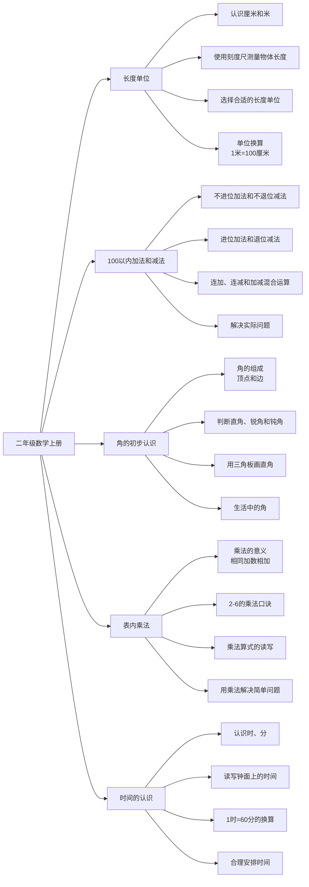

# 深圳市2025年小学二年级上册数学重点知识思维导图

## 概要回答
深圳市小学二年级上册数学课程主要涵盖长度单位、100以内加减法、角的初步认识、表内乘法以及时间的认识等内容。这些知识点为学生打下扎实的数学基础，培养计算能力和空间观念。

## 思维导图

## 教学建议
在实际教学中，可以通过以下方式帮助学生理解：
1. 使用实物测量帮助理解长度单位
2. 通过操作小棒理解进位退位
3. 利用折纸等活动认识角的特点
4. 通过背诵和应用熟练掌握乘法口诀
5. 结合日常生活认识时间的重要性