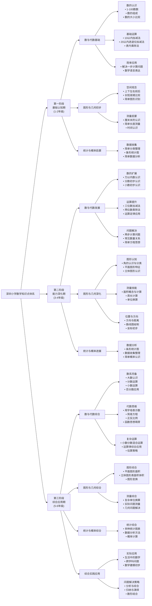

# 深圳市小学数学知识点总结

## 概要回答
深圳市小学数学课程遵循从基础到复合应用的递进关系，按照学生的认知发展规律，逐步构建完整的数学知识体系。整个课程分为三个阶段：低年级（1-2年级）以数与代数、图形与几何的基础认知为主；中年级（3-4年级）深化运算能力与空间观念；高年级（5-6年级）引入代数思维、统计概率等复杂概念，最终形成综合应用能力。

## 知识点结构图（层层递进关系）

## 深度解析

### 第一阶段：基础认知期（1-2年级）
此阶段是数学学习的启蒙期，重点在于建立数感和空间观念。
- **数与代数基础**：从具体的实物计数开始，逐步抽象到数字概念，掌握基本的加减乘除运算。
- **图形与几何初步**：通过观察和操作，认识常见的平面和立体图形，建立空间方位感。
- **统计与概率启蒙**：学习简单的数据收集和整理方法，培养数据分析意识。

### 第二阶段：能力深化期（3-4年级）
此阶段着重发展学生的运算能力和空间想象能力。
- **数的扩展**：引入更大的数、分数和小数概念，扩大学生的数系认知。
- **运算提升**：掌握多位数运算技巧，理解运算定律，提高计算准确性。
- **图形深化**：深入学习图形的性质和测量方法，发展空间观念。
- **数据分析能力**：能够制作和分析条形统计图，理解数据的意义。

### 第三阶段：综合应用期（5-6年级）
此阶段注重培养学生的代数思维和综合应用能力。
- **代数思维萌芽**：用字母表示数，学习简易方程，为中学代数学习做准备。
- **数系完备**：掌握分数、小数、百分数的运算，理解各种数之间的联系。
- **几何综合应用**：掌握复杂图形的面积和体积计算，理解图形变换。
- **统计与概率**：能够分析多种统计图表，理解概率的基本概念。
- **实际问题解决**：综合运用所学知识解决生活中的实际问题，培养数学建模能力。

## 教学建议

1. **循序渐进原则**：严格按照知识点的递进关系进行教学，确保学生牢固掌握前一阶段知识后再进入下一阶段。
2. **注重基础**：在低年级阶段要特别重视基础概念的建立，避免急于求成。
3. **联系生活**：将数学知识与学生的生活经验相结合，提高学习兴趣和应用能力。
4. **差异化教学**：关注学生的个体差异，提供不同层次的学习任务。
5. **实践操作**：通过动手操作和实践活动加深对抽象概念的理解。