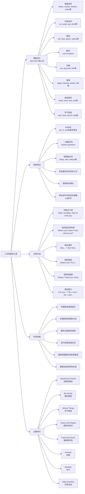

# 深圳市2025年小学二年级上册英语重点知识思维导图

## 概要回答
深圳市小学二年级上册英语课程主要围绕基础词汇、简单语法、日常对话和听说技能展开。通过主题式学习，培养学生对英语的兴趣，建立初步的语感，为后续英语学习奠定基础。

## 思维导图

## 教学建议
在实际教学中，可以通过以下方式帮助学生掌握英语知识：
1. 利用卡片、图片等直观教具教授词汇
2. 通过歌曲、游戏激发学习兴趣
3. 创设真实情境进行对话练习
4. 结合肢体语言帮助理解语法概念
5. 通过小组合作提高口语表达能力
6. 利用多媒体资源丰富学习体验