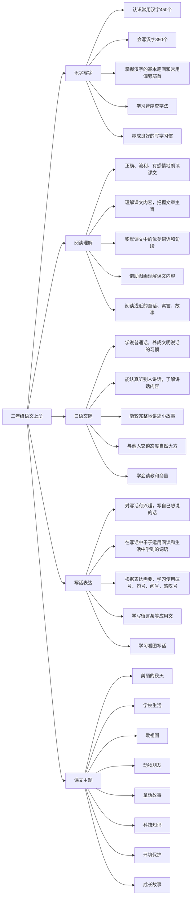

# 深圳市2025年小学二年级上册语文重点知识思维导图

## 概要回答
深圳市小学二年级上册语文课程主要围绕识字写字、阅读理解、口语交际和写话表达四个方面展开。通过八个专题的学习，培养学生的语言文字运用能力，提升文化素养和审美情趣。

## 思维导图

## 教学建议
在实际教学中，可以通过以下方式帮助学生掌握语文知识：
1. 通过游戏和竞赛激发识字兴趣
2. 利用多媒体课件提高阅读理解能力
3. 创设情境开展口语交际活动
4. 结合生活实际进行写话练习
5. 通过主题单元整合知识体系