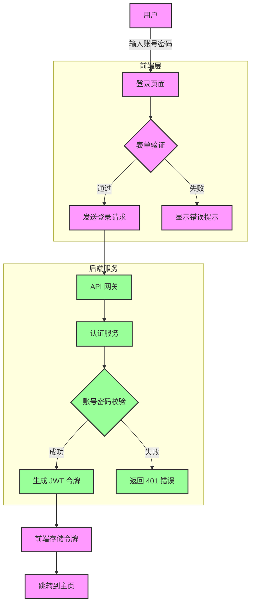
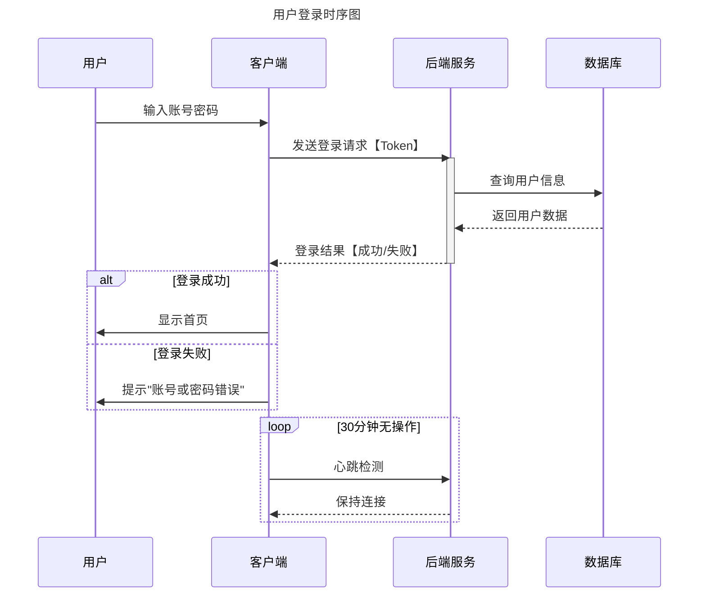
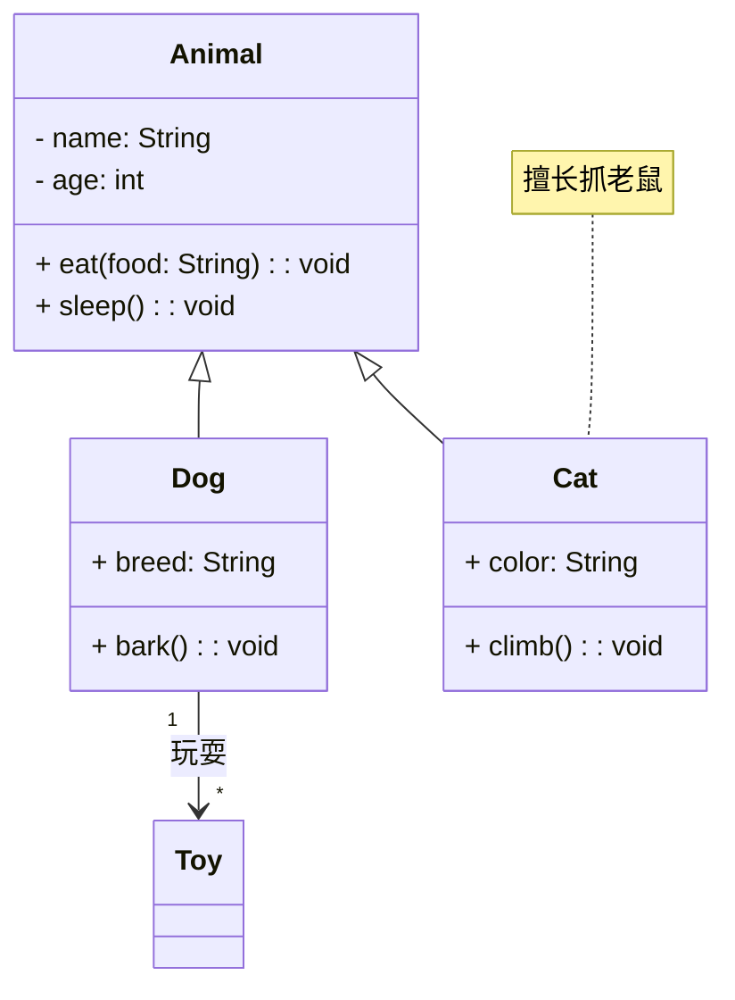
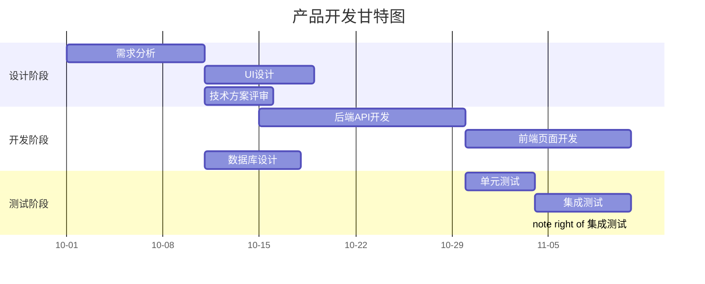
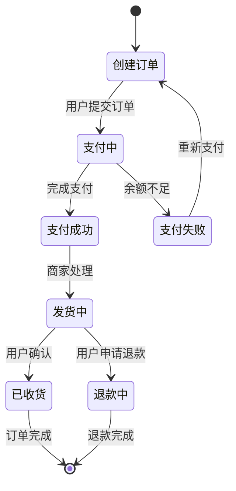
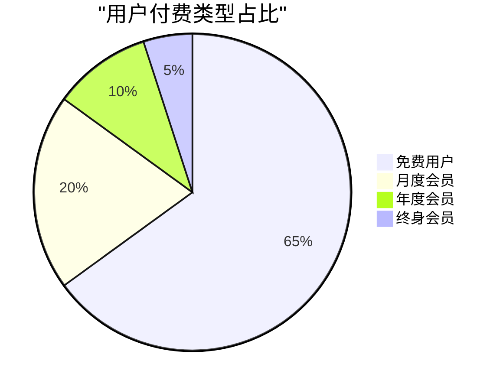

# Markdown Extension Examples

This page demonstrates some of the built-in markdown extensions provided by VitePress.

## Syntax Highlighting

VitePress provides Syntax Highlighting powered by [Shiki](https://github.com/shikijs/shiki), with additional features like line-highlighting:

**Input**

````md
```js{4}
export default {
  data () {
    return {
      msg: 'Highlighted!'
    }
  }
}
```
````

**Output**

```js{4}
export default {
  data () {
    return {
      msg: 'Highlighted!'
    }
  }
}
```

## Custom Containers

**Input**

```md
::: info
This is an info box.
:::

::: tip
This is a tip.
:::

::: warning
This is a warning.
:::

::: danger
This is a dangerous warning.
:::

::: details
This is a details block.
:::
```

**Output**

::: info
This is an info box.
:::

::: tip
This is a tip.
:::

::: warning
This is a warning.
:::

::: danger
This is a dangerous warning.
:::

::: details
This is a details block.
:::

## More

Check out the documentation for the [full list of markdown extensions](https://vitepress.dev/guide/markdown).


## 图片


## 图形

### 流程图 Flowchart
适用场景：业务流程、决策逻辑、步骤说明。
> graph TB 表示垂直流程图（TB=从上到下，LR=从左到右）。
> 节点用 [ ]（矩形）、{ }（菱形判断）、( )（圆角矩形）等符号定义。
> 箭头用 --> （实线）、-.->（虚线）、-- 标签 -->（带文本箭头）表示。
> subgraph 可创建子流程块，增强可读性。



### 时序图（Sequence Diagram）

适用场景：系统交互、API 调用流程、多角色协作。
工具：Mermaid 或 PlantUML。



### 类图（Class Diagram）
适用场景：面向对象设计、数据模型定义、类间关系。

说明：
> 类成员用 +（公有）、-（私有）、#（保护）标记可见性。
> 关系符号：<|--（继承）、-->（关联）、..|>（实现接口）、--*（聚合）。

### 甘特图（Gantt Chart）
适用场景：项目排期、任务进度管理、时间规划。



说明：
> dateFormat 定义日期格式，section 划分任务组。
> 任务用 任务名 : 标识, 开始日期, 持续时间 定义，after 任务标识 表示依赖关系。
> parallel 标记并行任务，note 可添加说明文本。

### 状态图（State Diagram）



### 饼图（Pie Chart）
